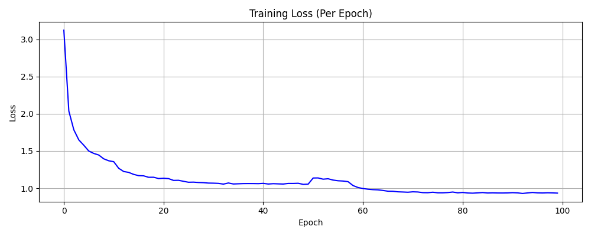
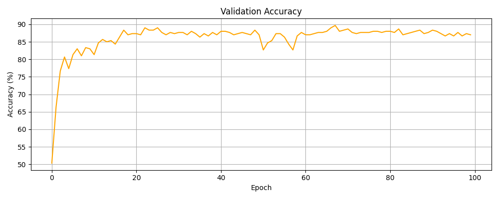
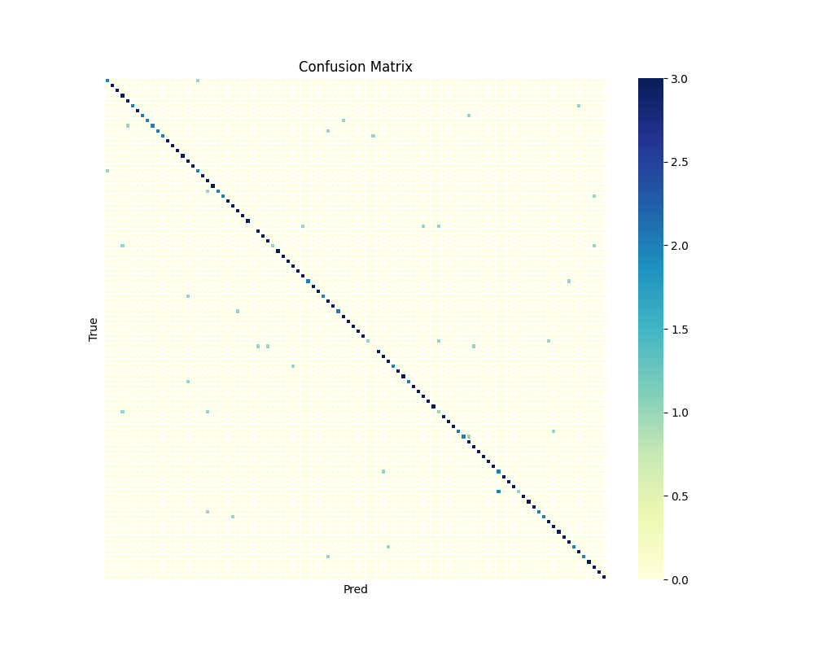

> # NYCU Computer Vision 2025 Spring HW1
- StudentID:313553037
- Name:黃瑜明
## Introduction
In this assignment, we utilize a model based on the ResNet architecture to classify natural organisms depicted in images into their corresponding categories. The goal is to accurately identify the species or biological class of each organism, among 100 distinct categories.
## How to install
1. Clone the repository
    ```
    git clone git@github.com:Kirita74/NYCU-Computer-Vision-2025-Spring-HW1.git
    cd NYCU-Computer-Vision-2025-Spring-HW1
    ```
2. Create and activate conda environmen
    ```
    conda env create -f environment.yml
    conda activate CV
    cd code
    ```
3. Download the dataset
    - Download the dataset form the provided [Link](https://drive.google.com/file/d/1fx4Z6xl5b6r4UFkBrn5l0oPEIagZxQ5u/view)
    - Place it in the following structure
    ```
    .
    ├── code
    │   ├── main.py
    │   ├── model.py
    │   └── test.py
    ├── data
    │   ├── train
    │   ├── val
    │   └── test
    ├── environment.yml
    │   .
    │   .
    │   .
    ```
## Run
- Train Model
    ```
    python3 main.py DATAPATH [--num_epochs EPOCH] [--batch_size BATCH_SIZE] [--learning_rate LEARNING_RATE] [--decay DECAY] [--eta_min ETA_MIN] [--pretrained_weight_path PRETRAINED_WEIGHT_PATH] [--save_path SAVE_PATH] [--log_dir LOG_DIR]
    ```
    Example:
    ```
    python3 main.py ../data --num_epochs 100 --batch_size 32 --learing_rate 1e-4 --decay 1e-5 --eta_min 1e-6 --pretraind_weight_path pretrained_model.pth --save_path save_model.pth --log_dir logs
    ```
- Test Model
    ```
    python3 test.py test_data_path pretrained_weight_path [--prediction_csv_path PREDICTION_CSV_PATH]
    ```
    Example:
    ```
    python3 test.py ../data/test pretrained_model.pth --prediction_csv_path prediction.csv
    ```

## Performance snapshot
### Training Parameter Configuration
| Parameter       | Value               |
| --------------- | ------------------- |
| Model           | `ResNeXt-101`       |
| Learing Rate    | 0.0001              |
| Batch Size      | 32                  |
| Opimizer        | `AdamW`             |
| Eta min         | 0.0000001           |
| T_max           | 30                  |
| Scheduler       | `CosineAnnealingLR` |
| Label smoothing | 0.1                 |
| Criterion       | `CrossEntropyLoss`  |
### Training Curve


### Confusion Matrix

### Perfomance
||Accuracy(%)|
|----------|--|
|Validation|90|
|Public test|93|
