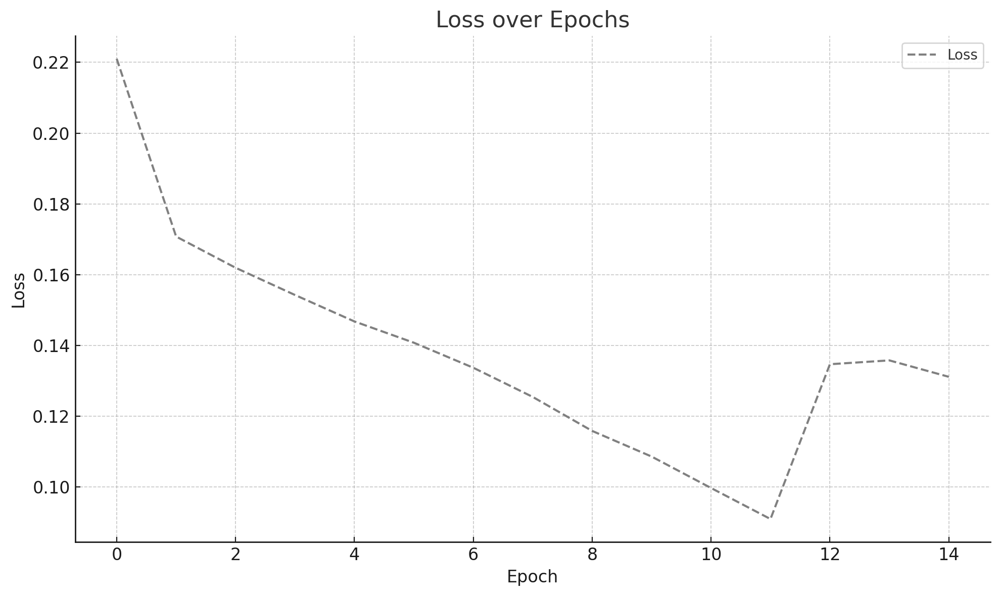
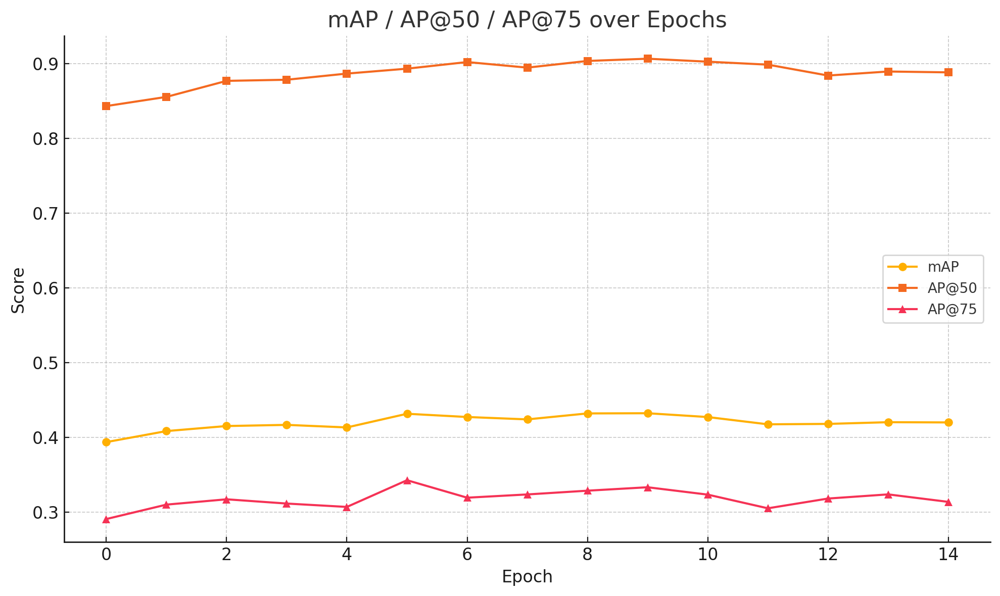
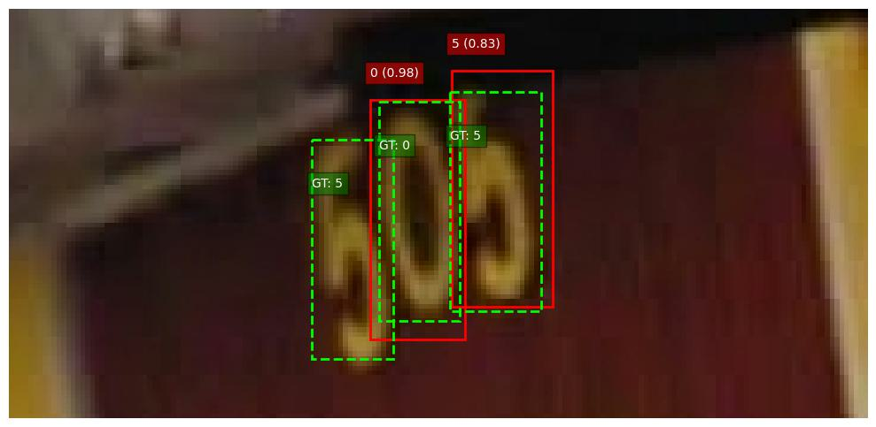
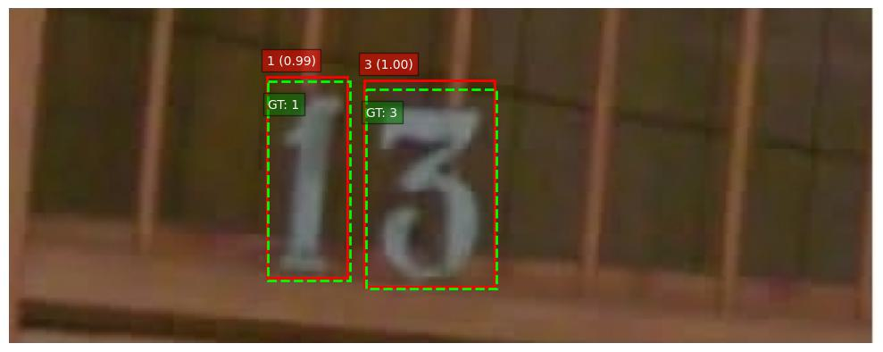

# NYCU Computer Vision 2025 Spring HW2
- StudentID:313553037
- Name:黃瑜明
## Introduction
Utilize Faster R-CNN, with ResNet-50 as the backbone to detect individual digits within an image. The model is trained to localize each digit by predicting its bounding box and to classify its corresponding digit class (0–9). After detecting all digits in an image, further process the results to recognize the complete number represented by the combination of detected digits.
## How to install
1. Clone the repository
    ```
    git clone git@github.com:Kirita74/NYCU-Computer-Vision-2025-Spring-HW2.git
    cd NYCU-Computer-Vision-2025-Spring-HW2
    ```
2. Create and activate conda environment
    ```
    conda env create -f environment.yml
    conda activate CV
    cd code
    ```
3. Download the dataset
    - Download the dataset form the provided [Link](https://drive.google.com/file/d/1fx4Z6xl5b6r4UFkBrn5l0oPEIagZxQ5u/view)
    - Place it in the following structure
    ```
    .
    ├── code
    │   ├── main.py
    │   ├── model.py
    │   └── dataset.py
    ├── data
    │   ├── train
    │   ├── val
    │   └── test
    ├── environment.yml
    │   .
    │   .
    │   .
    ```
## Run
- Train Model
    ```
    python3 main.py MODE DATAPATH [--num_epochs EPOCH] [--batch_size BATCH_SIZE] [--learning_rate LEARNING_RATE] [--decay DECAY] [--eta_min ETA_MIN] [--pretrained_weight_path PRETRAINED_WEIGHT_PATH] [--save_path SAVE_PATH] [--log_dir LOG_DIR]
    ```
    Example:
    ```
    python3 main.py "train" ../data --num_epochs 15 --batch_size 2 --learing_rate 1e-4 --decay 1e-5 --eta_min 1e-6 --pretraind_weight_path pretrained_model.pth --save_path save_model.pth --log_dir logs
    ```
- Test Model
    Example:
    ```
    python3 main.py "test" --pretraind_weight_path pretrained_model.pth 
    ```

## Performance snapshot
### Training Parameter Configuration
| Parameter                      | Value                                                                      |
|-------------------------------|----------------------------------------------------------------------------|
| **Model**                     | `ResNet 50`                                                                |
| **RPN Anchor Sizes**          | (4,), (8,), (16,), (32,), (64,)                                            |
| **RPN Anchor Aspect Ratios**  | (0.5, 1.0, 2.0) × 5                                                         |
| **ROI Align Featuremaps**     | `['0', '1', '2', '3']`                                                     |
| **ROI Align Output Size**     | 7 × 7                                                                      |
| **ROI Align Sampling Ratio**  | 2                                                                          |
| **Optimizer**                 | `AdamW`                                                                    |
| **Learning Rate**             | 5e-5                                                                       |
| **Weight Decay**              | 1e-4                                                                       |
| **Scheduler**                 | `CosineAnnealingLR`                                                        |
| **T_max**                     | 15                                                                         |
| **Epochs**                    | 15                                                                         |
| **Batch Size**                | 2                                                                          |

### Training Curve
- Epoch loss
    
- Mean Average Precision
    

### Example of digit detection and recognition
- Example 1
    
- Example 2
    
  
### Perfomance
||Accuracy(%)|
|----------|--|
|Public mAP|35|
|Public test|29|
