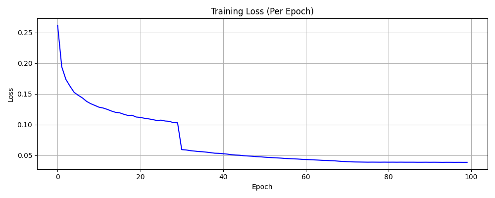

# NYCU VRDL 2025 Spring HW4
- StudentID: 313553037
- Name: 黃瑜明
## Introduction
Utilize modified PromptIR to restore degraded images. The model is trained to remove snow and raindrop artifacts while enhancing overall image quality.
## How to install
1. Clone the repository
    ```
    git clone git@github.com:Kirita74/NYCU-VRDL-2025-Spring.git
    cd NYCU-VRDL-2025-Spring\hw4
    ```
2. Create and activate conda environment
    ```
    conda env create -f environment.yml
    conda activate CV
    cd code
    ```
3. Download the dataset
    - Download the dataset form the provided [Link](https://drive.google.com/drive/folders/1Q4qLPMCKdjn-iGgXV_8wujDmvDpSI1ul)
    - Place it in the following structure
    ```
    .
    ├── code
    |   ├── example_img2npz.py
    │   ├── utils.py
    │   ├── main.py
    │   ├── PromptIR.py
    │   └── dataset.py
    ├── hw4_realse_dataset
    │   ├── train
    |   └── test
    ├── environment.yml
    │   .
    │   .
    │   .
    ```
## 

- Train Model
    ```
    python3 main.py MODE DATAPATH [--save_dir SAVE_DIR][--num_epochs EPOCH] [--batch_size BATCH_SIZE] [--learning_rate LEARNING_RATE] [--decay DECAY] [--pretrained_weight_path PRETRAINED_WEIGHT_PATH] [--log_dir LOG_DIR]
    ```
    Example:
    ```
    python3 main.py "train" ..\\hw4_realse_dataset --save_dir weight --num_epochs 100 --batch_size 1 --learing_rate 1e-4 --decay 5e-5 --pretraind_weight_path pretrained_model.pth --log_dir logs
    ```
- Test Model
    Example:
    ```
    python3 main.py "test" DATAPATH --pretraind_weight_path pretrained_model.pth
    ```

## Performance snapshot
### Training Parameter Configuration
| Parameter                      | Value                                                                      |
|-------------------------------|----------------------------------------------------------------------------|
| **Model**                     | `PromptIR`                                                                |
| **Optimizer**                 | `AdamW`                                                                    |
| **Learning Rate**             | 1e-4                                                                       |
| **Weight Decay**              | 5e-5                                                                       |
| **Scheduler**                 | `CosineAnnealingLR`                                                        |
| **T_max**                     | 100                                                                        |
| **Epochs**                    | 100                                                                         |
| **Batch Size**                | 1                                                                          |

### Training Curve
- Epoch loss
    
- Mean Average Precision
    

### Perfomance
||PSNR|
|----------|--|
|Public valid|31.26|
|Public test|31.04|